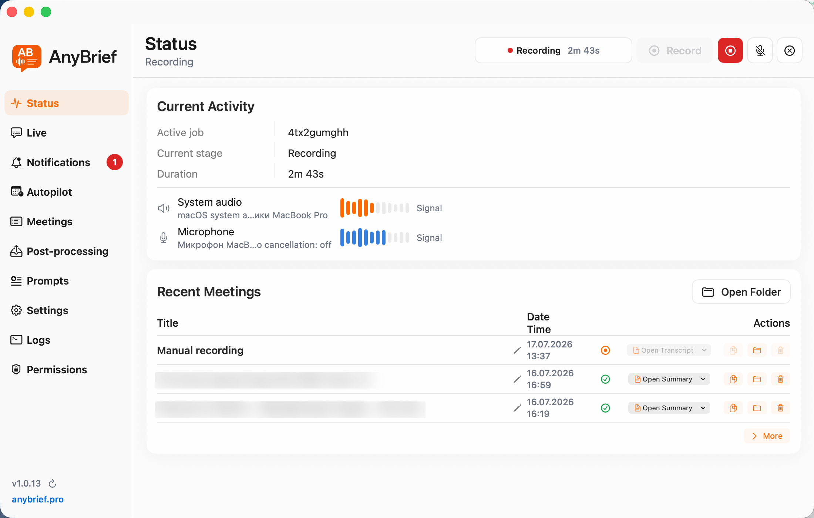
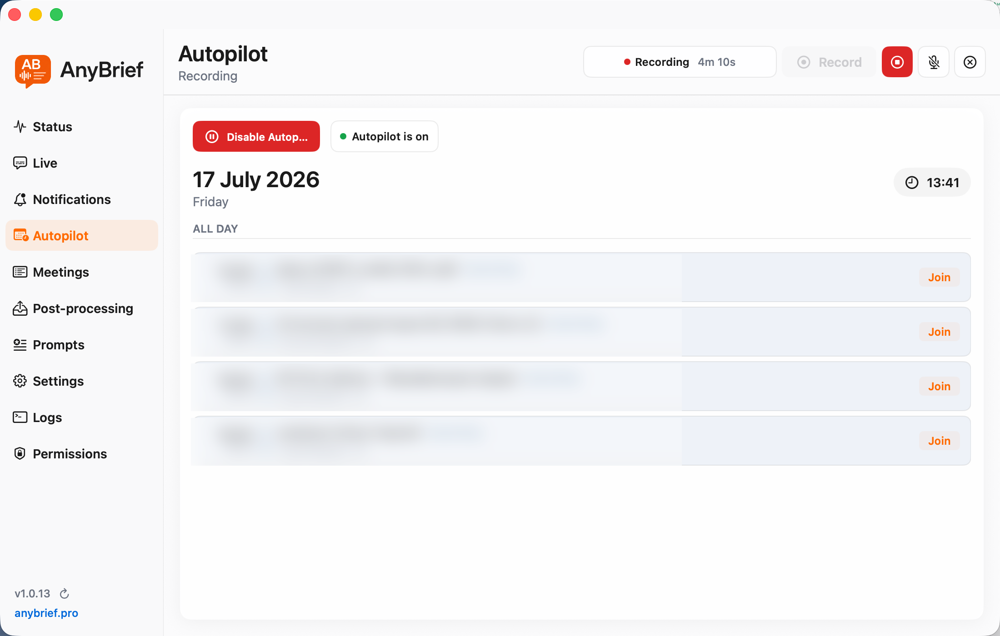
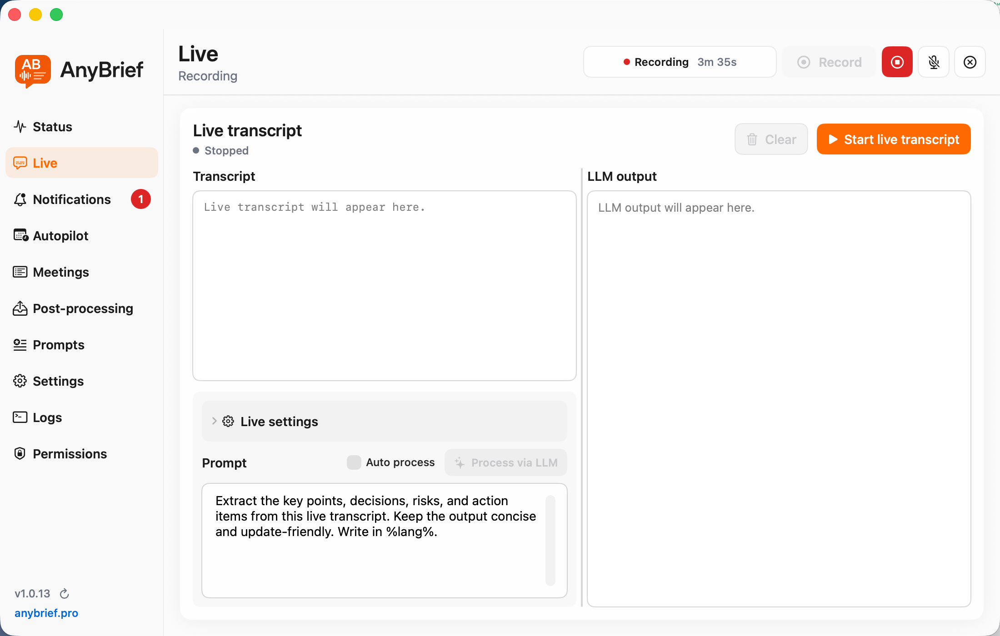
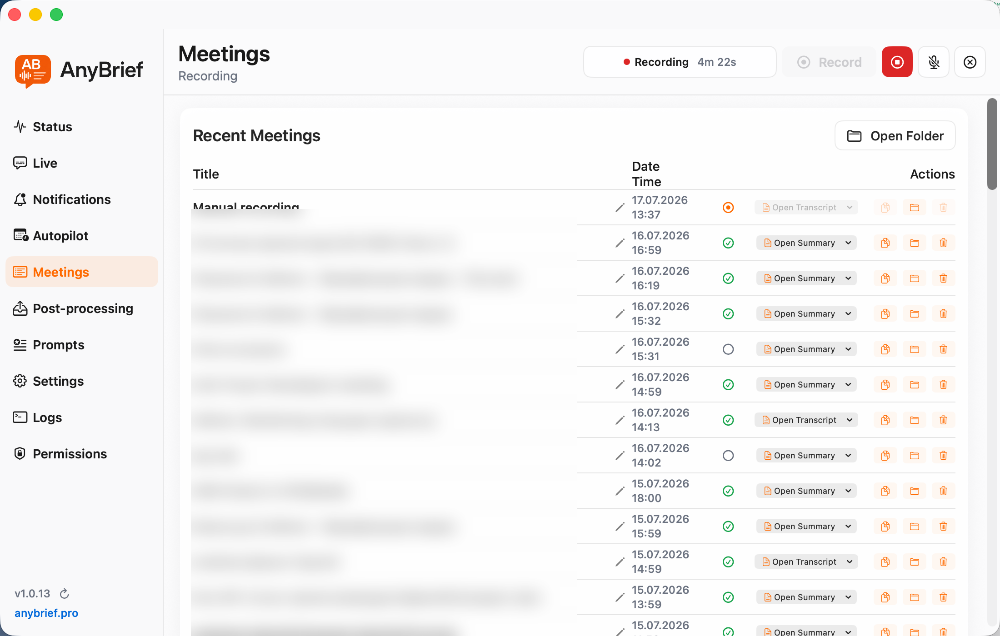
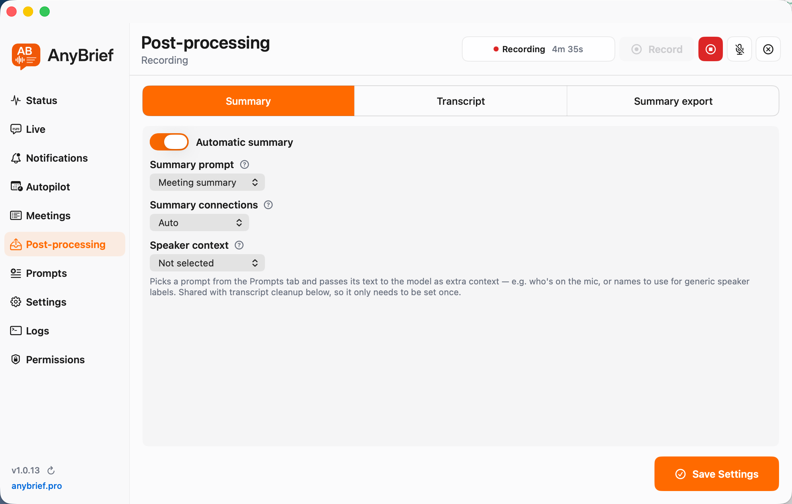
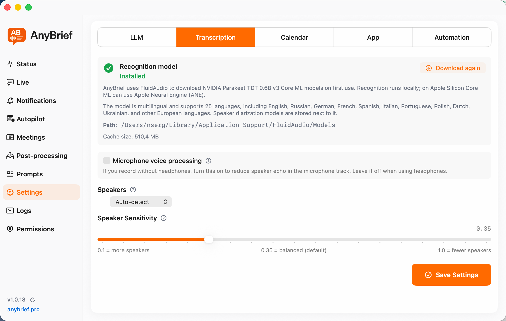

# AnyBrief

**Local-first macOS meeting recorder with system audio capture, microphone
recording, offline speech recognition, speaker diarization, live transcription,
and AI-generated meeting notes.**

[Website](https://anybrief.pro/) ·
[Download for macOS](https://anybrief.pro/AnyBrief.dmg) ·
[Report a bug](https://github.com/iddserg/anybrief-macos-meeting-recorder/issues)


AnyBrief is a native Swift and SwiftUI meeting assistant for macOS. It records
system audio and microphone audio directly on the Mac, turns calls into
speaker-attributed transcripts, and produces structured Markdown summaries.
There is no meeting bot and no mandatory cloud account.

Transcription can run locally through FluidAudio/Parakeet or whisper.cpp.
Summaries can use local Ollama models, an OpenAI-compatible API, or trusted
command-line AI tools. Calendar, window, and localhost API automations can
start and stop recordings without manual setup before every call.

## Screenshots

| Recording status | Calendar autopilot |
| --- | --- |
|  |  |

| Live transcription | Meeting history |
| --- | --- |
|  |  |

| AI summary settings | Speech recognition settings |
| --- | --- |
|  |  |

More application screenshots are available in
[`docs/screenshots`](docs/screenshots).

## Features

- Native macOS menu bar application built with Swift, SwiftUI, AppKit,
  ScreenCaptureKit, and Core Audio.
- Simultaneous system audio and microphone recording, including resilient input
  switching for AirPods and other microphones.
- Local speech-to-text with two interchangeable engines:
  - FluidAudio Parakeet transcription with offline VBx speaker diarization.
  - whisper.cpp recognition aligned with FluidAudio diarization.
- Silero VAD before Whisper recognition to reduce silence hallucinations.
- Exact, automatic, maximum, or calendar-derived speaker counts.
- Provider-specific recognition dictionaries and phrase normalization.
- Optional live transcript while a recording is active.
- Structured Markdown meeting notes, action items, decisions, metadata, and
  calendar frontmatter.
- Ollama, OpenAI-compatible, and trusted CLI LLM connections with ordered
  fallback, timeouts, and retries.
- Prompt library with per-task assignments and meeting-title pattern matching.
- CalDAV meeting autopilot with scheduled start and stop.
- Window and process observer automation for Zoom, Teams, browsers, and other
  meeting applications.
- Localhost HTTP API for agents and local automation.
- Post-processing rules that copy generated summaries into existing folders.
- Persistent job stages and recovery after interrupted processing.
- Local storage for recordings, transcripts, summaries, metadata, and logs.

## Privacy

Recording and speech recognition run locally. Meeting files remain on the Mac
unless the user explicitly configures an external LLM endpoint, CLI tool,
calendar server, or export destination.

Secrets are stored behind `SecretStoreProtocol`: release builds use macOS
Keychain and debug builds use a local development store. The Local HTTP API is
bound to `127.0.0.1` and protected by an API key.

Always follow applicable consent and recording laws before recording a call.

## Repository layout

```text
AnyBrief/           Native macOS application source and resources
AnyBriefTests/      Application and pipeline tests
STTCLI/             FluidAudio/Parakeet transcription + diarization CLI source
WhisperSTTCLI/      whisper.cpp timestamp/alignment wrapper source
docs/screenshots/   Product screenshots used by this README
Makefile            Local CLI, app, DMG, signing, and notarization targets
```

The repository intentionally contains all AnyBrief-owned source required for
both speech-recognition paths. `Makefile` downloads pinned third-party sources
and model dependencies when they are needed; generated binaries, model weights,
build output, signing material, and the production website are not committed.

## Requirements

- macOS 14 or later
- Xcode 16 or later
- Swift 6 toolchain
- Xcode command-line tools
- `make`, `git`, `curl`, `cmake`, `tar`, `codesign`, and `hdiutil`
- Internet access for the first dependency and model download

Apple Silicon is recommended for FluidAudio and CoreML performance. The release
build targets both Apple Silicon and Intel where supported by its dependencies.

## Build

Build the application source:

```bash
xcodebuild build \
  -scheme AnyBrief \
  -project AnyBrief.xcodeproj \
  -destination platform=macOS \
  -derivedDataPath /private/tmp/anybrief-derived \
  CODE_SIGNING_ALLOWED=NO
```

Build the helper binaries used by the complete app bundle:

```bash
make cli
```

This builds:

- `bin/stt` from the checked-in `STTCLI`;
- `bin/whisper-stt` from the checked-in `WhisperSTTCLI`;
- `bin/whisper-cli-core` from pinned `whisper.cpp`;
- `bin/ffmpeg` from pinned FFmpeg and LAME sources.

Build and launch a development app with those binaries embedded:

```bash
make dev
```

Or perform the complete sequence:

```bash
make run
```

The first local transcription downloads the selected model. Model files are
stored outside the repository.

## Tests

```bash
xcodebuild test \
  -scheme AnyBrief \
  -project AnyBrief.xcodeproj \
  -destination platform=macOS \
  -derivedDataPath /private/tmp/anybrief-derived

swift test --package-path STTCLI
swift test --package-path WhisperSTTCLI
```

`make test` runs the same suites.

## Release builds

`make dmg` creates a locally signed universal DMG. Developer ID signing and
Apple notarization require the maintainer's own certificate and notary profile:

```bash
make notarized-dmg \
  CODE_SIGN_IDENTITY="Developer ID Application: Your Name (TEAMID)" \
  NOTARY_KEYCHAIN_PROFILE=your-notary-profile
```

Signing credentials and production deployment configuration are deliberately
not part of this public source repository. Official notarized builds are
available from [anybrief.pro](https://anybrief.pro/).

## Architecture

AnyBrief is organized by domain and pluggable module type:

- Recording owns local system and microphone capture.
- Pipeline owns finalization, transcription, transcript cleanup, summaries,
  packaging, and recovery.
- Transcription and LLM layers expose common contracts and registries.
- Concrete STT, LLM, and automation integrations own their configuration,
  diagnostics, runners, and settings UI.
- `LLMService` is the single entry point for text-processing calls and fallback.
- Live transcription is isolated from the final persisted transcript pipeline.

This keeps provider-specific logic out of the dashboard and orchestration code
and makes additional local or remote providers independently replaceable.

## Contributing

See [CONTRIBUTING.md](CONTRIBUTING.md). Please report security issues through
the private process described in [SECURITY.md](SECURITY.md).

## License

AnyBrief is released under the [MIT License](LICENSE). Embedded and downloaded
dependencies remain under their respective licenses; see
[THIRD_PARTY_NOTICES.md](THIRD_PARTY_NOTICES.md) and `STTCLI/LICENSE`.
