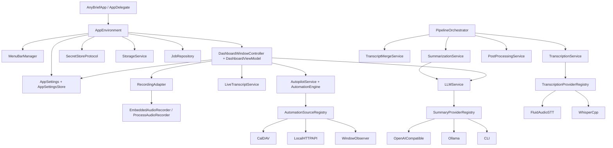

# AnyBrief

AnyBrief is a macOS menu bar app for recording calls, transcribing audio, and producing concise Markdown summaries. It records system audio and microphone audio locally, runs speech-to-text through bundled FluidAudio or whisper.cpp CLIs, and can create summaries through local Ollama, OpenAI-compatible APIs, or trusted CLI tools.

The app is designed as a small call autopilot: it can record manually, start and stop recording from a CalDAV calendar schedule, keep meeting files organized, and expose a localhost API for local automations.

## Features

- Menu bar app with a dashboard window and compact macOS-style controls.
- Separate system audio and microphone tracks, with live signal indicators.
- Opt-in live transcript pane for recent system audio during active recording.
- Microphone silence mode: keep the timeline intact while not recording microphone sound.
- CalDAV autopilot for scheduled calls:
  - starts and stops recordings around calendar events
  - can ignore microphone audio on auto-start
  - uses calendar event title as the meeting name
  - can pass participant count from the calendar as the maximum speaker count
- Local transcription through bundled FluidAudio `stt` or `whisper-stt` + `whisper-cli-core`.
- Summary generation through configurable providers:
  - local Ollama
  - OpenAI-compatible chat completions APIs
  - trusted local CLI tools such as Codex, Claude, or opencode
- Optional post-processing tab with rules that copy generated Markdown summaries into existing folders.
- Meeting history with rename, delete, open summary, and reveal in Finder actions.
- Summary frontmatter with meeting metadata, including calendar data when available.
- Local HTTP API for agents and localhost automations.
- Permission checks, settings, logs, notifications, and static landing pages.

## Repository Layout

- `AnyBrief/` - macOS app source code.
- `AnyBrief/App/AppShell/` - SwiftUI entry point, app delegate, app environment, menu bar, app windows.
- `AnyBrief/App/Core/` - shared settings, secrets, storage, logging, networking, permissions, notifications, updates, and lifecycle services.
- `AnyBrief/App/Recording/` - recording facade, sessions, errors, and audio recorder implementations.
- `AnyBrief/App/Pipeline/` - recording finalization, transcription/merge/summary orchestration, audio conversion, and bundle packaging.
- `AnyBrief/App/Transcription/` - transcription contracts, registry, service, transcript models, and reusable parsers.
- `AnyBrief/App/TranscriptionProviders/` - concrete transcription provider modules: `FluidAudioSTT` and `WhisperCpp`.
- `AnyBrief/App/LiveTranscript/` - experimental opt-in live transcript runtime for system audio chunks while the dashboard live pane is open.
- `AnyBrief/App/LLM/` - shared LLM layer: `LLMService` (single entry point for all LLM calls), LLM connection settings, and the prompt collection with task assignments.
- `AnyBrief/App/Summary/` - summary orchestration on top of `LLMService`, provider contracts/registry, metadata, and shared settings controls.
- `AnyBrief/App/SummaryProviders/` - concrete LLM provider modules. Current providers: `OpenAICompatible`, `Ollama`, and `CLI`.
- `AnyBrief/App/PostProcessing/` - post-summary export settings and services for copying Markdown summaries into existing external folders.
- `AnyBrief/App/Automation/` - automation contracts, source registry, engine, events, actions, and rules.
- `AnyBrief/App/AutomationSources/` - concrete automation source modules. Current sources: `CalDAV`, `LocalHTTPAPI`, and `WindowObserver`.
- `AnyBrief/App/Dashboard/` - dashboard shell, view model, sections, controls, and module-owned settings bridges.
- `AnyBrief/Resources/` - app icons, logos, localization, and plist resources.
- `AnyBriefTests/` - unit tests for settings, registries, parsing, automation, transcription, summarization, recording, and pipeline behavior.
- `docs/product-development-plan.md` - current architecture plan and completed migration checklist.
- `landing/` - static landing page. The download button expects `landing/AnyBrief.dmg`.
- `landing-en/` - English static landing page.
- `Makefile` - build, CLI embedding, signing, and DMG packaging commands.

## Architecture

AnyBrief is a single macOS app bundle. Recording, permissions, settings, local API, calendar sync, transcription, and summary generation run inside the app process. External binaries are used for bundled command-line tools such as `stt`, `whisper-stt`, `whisper-cli-core`, and `ffmpeg`, and optionally for trusted CLI summary providers.

The codebase is organized around registries and provider/source modules:

- LLM access is centralized in `LLMService` (`App/LLM/`): text + prompt + connection chain -> output with fallback. Connections (`llm.connections`) are provider envelopes without prompts; prompts and per-task LLM assignments live in the `prompts` settings section and the Prompts sidebar section. Summarization picks its prompt by meeting-title patterns first, then by assignment. Every task (summary, transcript cleanup, Live) supports Auto: with no explicit selection the fallback chain is all enabled connections in pool order.
- LLM providers implement `SummaryProviderModule` and keep their config, defaults, diagnostics, DTOs, runners, and settings UI under `SummaryProviders/<Provider>/`. Runners read the prompt from `SummaryProviderInput.systemPrompt` only.
- Transcription providers implement `TranscriptionProviderModule` and keep provider-owned config and runtime code under `TranscriptionProviders/<Provider>/`.
- Live transcript is an isolated experimental realtime path: it captures system audio into temporary rolling chunks and uses the bundled `stt` CLI with `--transcribe-only`; it remains non-diarized, is disabled by default, and is not used as the final meeting transcript.
- Post-processing runs after summary writing and only copies generated `summary.md` files into pre-existing destination folders matched by calendar title rules. The Post-processing pane also hosts the automatic-summary and transcript-cleanup settings.
- Automation sources implement `AutomationSourceModule` and keep source-owned config, diagnostics, runtime source, and settings UI under `AutomationSources/<Source>/`. `AutopilotService` builds sources from the registry only and does not know concrete source services; for example, `CalDAVCalendarService` is owned by the CalDAV module.
- Common folders contain contracts, registries, orchestration, and shared models only.
- Pipeline stages are the typed `JobStage` enum in `Core/Storage/Job.swift`. Its raw values are persisted in `jobs.json` and exposed by the Local HTTP API, so they must stay stable. Startup recovery resumes jobs from their persisted stage through one shared pipeline path.
- Concrete settings are stored as envelopes: `id/provider/enabled/payload` for providers and `id/source/enabled/payload` or `id/kind/source/enabled/payload` for automation sources and rules.



Main responsibilities:

| Area | Responsibility |
| --- | --- |
| `AppShell/` | App startup, app delegate extensions, menu bar, dashboard presentation, environment construction. |
| `Core/Settings/` | `AppSettings`, grouped config persistence, config import/export, payload storage, and reset of old flat settings files. |
| `Core/Keychain/` | `SecretStoreProtocol`, release Keychain store, and debug file-backed secret store. |
| `Core/Networking/` | Neutral JSON HTTP client and retry policy. |
| `Core/Storage/` | `StorageService`, `Job`, and `JobRepository`. |
| `Recording/` | Recording facade, session model, recording errors, process recorder, and embedded audio recorder. |
| `Pipeline/` | `PipelineOrchestrator` and helpers for transcription, merge, summary, finalization, conversion, and packaging. |
| `Transcription/` | Provider contracts, registry, `TranscriptionService`, transcript models, and reusable transcript parsers. |
| `TranscriptionProviders/FluidAudioSTT/` | Bundled `stt` provider: one full-file Parakeet pass aligned to FluidAudio offline VBx diarization with token timestamps, plus settings, diagnostics, and model service. |
| `TranscriptionProviders/WhisperCpp/` | One-pass whisper.cpp recognition combined with FluidAudio offline VBx speaker diarization. |
| `WhisperSTTCLI/` | Tracked `whisper-stt` wrapper that aligns whisper.cpp word timestamps with FluidAudio speaker intervals. |
| `LiveTranscript/` | Opt-in live transcript runtime, system-audio rolling buffer, temporary chunk STT runner, and boundary deduplication. |
| `Summary/` | Provider contracts, registry, `SummarizationService`, prompt builder, metadata/frontmatter, and shared provider UI controls. |
| `SummaryProviders/OpenAICompatible/` | OpenAI-compatible config, DTOs, defaults, diagnostics, runner, module, and settings view. |
| `SummaryProviders/Ollama/` | Ollama config, DTOs, defaults, model discovery, diagnostics, runner, module, and settings view. |
| `SummaryProviders/CLI/` | CLI config, defaults, diagnostics, runner, module, presets, and settings view. |
| `PostProcessing/` | Rule settings and `PostProcessingService` for exporting only generated Markdown summaries to existing folders. |
| `Automation/` | Automation contracts, source registry, runtime engine, events, actions, resolver, and autopilot service. |
| `AutomationSources/CalDAV/` | CalDAV config, calendar service/parser, diagnostics, source module, dashboard bridge, and settings view. |
| `AutomationSources/LocalHTTPAPI/` | Local API service, listener, handlers, payloads, settings mapper, diagnostics, and source module. |
| `AutomationSources/WindowObserver/` | Window observer config, matcher, source, diagnostics/module, and settings view. |
| `Dashboard/` | Dashboard shell, navigation, toolbar, view model extensions, settings sections, and reusable components. |

Primary flows:

1. Manual recording: dashboard/menu -> `RecordingAdapter` -> `EmbeddedAudioRecorder` -> meeting files.
2. Scheduled/window automation: `AutopilotService` starts `AutomationEngine`; enabled sources emit events; `AutomationActionResolver` turns events into recording actions.
3. Live transcript: when the experimental app setting is enabled, the dashboard Live pane can start `LiveTranscriptService` while the pane is open and the user starts live transcript; it stops on pane close, toggle off, or disabling the setting.
4. Processing: `PipelineOrchestrator` finalizes recording output, calls `TranscriptionService`, merges transcript segments, optionally runs the LLM transcript cleanup (`processing_transcript` stage: fixes recognition errors and fills in speaker names from calendar context, overwriting `transcript.txt`), and calls `SummarizationService` when automatic summaries are enabled.
5. Summary fallback: `SummarizationService` resolves the prompt and connection chain from `prompts`/`llm` settings and calls `LLMService`, which tries connections in order until one returns a non-empty result.
6. Post-processing: when enabled, `PostProcessingService` matches the calendar title to a rule and copies `summary.md` to the configured existing folder.
7. Admin config import: `AppSettingsConfigFile` mirrors grouped `AppSettings`; filled secret fields are moved into the active `SecretStoreProtocol` implementation.

## Requirements

- macOS 14.0 or newer
- Xcode and `xcodebuild`
- Swift toolchain
- Command line tools: `make`, `git`, `curl`, `tar`, `codesign`, `hdiutil`
- Network access for:
  - cloning/building `stt`
  - cloning/building the pinned whisper.cpp CLI
  - downloading/building `ffmpeg`
  - calling configured remote summary APIs
  - optional CalDAV calendar sync

## External Binaries

The release app bundle embeds:

- `stt` - built from `https://github.com/iddserg/stt`
- `whisper-stt` - tracked wrapper built from `WhisperSTTCLI/`
- `whisper-cli-core` - whisper.cpp full-file transcription executable
- `ffmpeg` - built by the local `Makefile`

Recording itself runs in-process inside AnyBrief so macOS permissions belong to the app bundle, not to a helper process.

## Build And Run

From the repository root:

```bash
make run
```

`make run` pulls the latest `main`, builds the external CLIs, builds the Debug app, embeds the CLIs, and launches AnyBrief.

For a faster local restart after the CLIs already exist:

```bash
make dev
```

Manual build steps:

```bash
make cli
make build
make embed-cli-debug
```

## Release DMGs

```bash
make dmg
```

The default `make dmg` build is for local testing. It uses ad-hoc signing and writes:

- `build/Release/AnyBrief.app`
- `build/Release/AnyBrief.dmg`

The ad-hoc DMG target builds universal `arm64` and `x86_64` binaries, embeds `stt`, `whisper-stt`, `whisper-cli-core`, and `ffmpeg`, signs the app bundle with `CODE_SIGN_IDENTITY=-`, verifies universal slices, and creates the disk image. Use this build for local development and permission testing.

For a Developer ID signed release/notarization candidate:

```bash
make signed-dmg \
  CODE_SIGN_IDENTITY="Developer ID Application: ALEXANDRA DMITRIEVNA IGNATOVA (2427492729)" \
  CODE_SIGN_STYLE=Manual \
  DEVELOPMENT_TEAM=2427492729 \
  CODESIGN_EXTRA_FLAGS="--timestamp --options runtime"
```

To sign and notarize in one step, use `make notarized-dmg` with the same variables; it runs `signed-dmg` and `notarize-dmg` back to back. See `docs/local-release-build.md` for the full release walkthrough.

Signed release artifacts:

- `build/Release/AnyBrief.app`
- `build/Signed/AnyBrief-signed.dmg`

`AnyBrief/Resources/AnyBrief.entitlements` is applied by default and grants the hardened runtime audio input entitlement required for microphone access in Developer ID builds.

After `make signed-dmg`, notarize and staple the signed DMG:

```bash
make notarize-dmg
```

`make notarize-dmg` uses the `anybrief-notary` keychain profile. If the notarytool keychain profile is missing, recreate it once:

```bash
xcrun notarytool store-credentials anybrief-notary \
  --apple-id "$APPLE_ID" \
  --team-id "2427492729" \
  --password "$APPLE_APP_SPECIFIC_PASSWORD"
```

Archive the final stapled DMG before publishing:

```bash
make archive-signed-dmg RELEASE_ID=2026-05-22_1.0.3-microphone-fix
```

`make signed-dmg` also preserves the previous `build/Signed/AnyBrief-signed.dmg` in `releases/prebuild-.../` before replacing it, so older signed release images are not lost during rebuilds. The `releases/` directory is ignored by git.

## Landing Page

The static landing page lives in `landing/index.html`.

To publish a fresh signed download from a local build, prepare both site DMGs and archive the exact files that will be uploaded:

```bash
make prepare-site-dmgs RELEASE_ID=2026-05-22_1.0.3-microphone-fix
```

Production currently serves the landing root as:

- `index.html`
- `AnyBrief.dmg`
- `version.json`

Do not commit `landing/AnyBrief.dmg` or `landing-en/AnyBrief.dmg`; they are generated release artifacts. Published copies are archived under `releases/<release-id>/published/`.

## Site Deploy

Deployment settings are kept out of git. Prepare a local deploy file:

```bash
cp deploy.example.env deploy.env
```

Then edit `deploy.env`:

```bash
ANYBRIEF_DEPLOY_HOST=your-server
ANYBRIEF_DEPLOY_USER=root
ANYBRIEF_DEPLOY_PATH=/var/www/anybrief
ANYBRIEF_DEPLOY_BASE_URL=https://anybrief.ru
ANYBRIEF_DEPLOY_SSH_PORT=22
ANYBRIEF_DEPLOY_SCP_OPTS="-o StrictHostKeyChecking=accept-new"
```

Authentication should come from your SSH key or `~/.ssh/config`; do not store server passwords in `deploy.env`.

Build and deploy:

```bash
make dmg
make deploy-site
```

`make deploy-site` copies `build/Release/AnyBrief.dmg` to `landing/AnyBrief.dmg`, uploads `landing/index.html` and `landing/AnyBrief.dmg` to the configured server path, and checks the configured public URL.
It also regenerates and uploads `landing/version.json`, which the app reads to offer a manual download when a newer version is available.
Both sites publish a localized `changelog.html`; `version.json` points `releaseNotesURL` to that page. Update the newest release entry in `landing/changelog.html` and `landing-en/changelog.html` before publishing a new version. The deploy target uploads both changelogs and their updated sitemaps automatically.

For the signed/notarized production download, use `make prepare-site-dmgs RELEASE_ID=...` after stapling. That command copies `build/Signed/AnyBrief-signed.dmg` to both landing download paths and archives the exact published DMGs under `releases/<release-id>/published/`.

## First Launch

On first launch AnyBrief asks for:

- microphone access
- screen and system audio recording permission
- notifications

Calendar, automatic summaries, the local HTTP API, and call reminders are optional and are disabled until configured.

## Settings

Dashboard settings are split into tabs:

- LLM - connection pool: ordered connection list, provider-owned settings views, and diagnostics. The prompt collection lives in the Prompts sidebar section; the automatic-summary toggle, speaker context, transcript cleanup, and per-task prompt/connection assignments live in the Post-processing pane (Live assignments in the Live pane).
- Recognition - choose FluidAudio STT or whisper.cpp, optionally separate speakers, select the Whisper model/language, and configure a provider-specific custom vocabulary. Vocabulary lines use `Preferred term: alias 1, alias 2`; FluidAudio applies native CTC vocabulary rescoring and whisper.cpp receives the preferred terms as its initial prompt. The default diarization threshold is `0.65`; exact speaker mode forces the requested count with a fallback, while maximum and calendar modes allow fewer speakers.
  Existing grouped settings that still contain the former `0.35` default are migrated once to `0.65`; later manual changes are preserved.
- Calendar - optional CalDAV source connection, calendar picker, and calendar autopilot rule timing.
- App - local application behavior, Dock icon, language, and admin config import/export.
- Integrations - automation sources such as Local HTTP API and WindowObserver.

Secrets are accessed through `SecretStoreProtocol`:

- CalDAV password
- Local HTTP API key
- OpenAI-compatible provider API keys

Release builds use macOS Keychain. Debug builds use a file-backed debug secret store so local development does not prompt for the Keychain password on every run. Exported config files contain empty secret fields. Filled secret fields are accepted on import and saved to the active secret store.

### Speaker-count modes

The selected recognition provider owns its speaker mode and count:

| Settings mode | Persisted value | CLI argument | Meaning |
| --- | --- | --- | --- |
| Auto-detect | `auto` | `--speakers=-1` | FluidAudio chooses the speaker count. |
| From calendar (maximum) | `calendar` | `--speaker-max=N` | Calendar participant count becomes an upper bound; fewer speakers are valid. |
| Exact count | `fixed` | `--speakers=N` | Requires exactly N speakers; the CLI applies its clustering fallback if reconstruction returns another count. |
| Maximum count | `max` | `--speaker-max=N` | Allows any detected count from one through N. |

`--speakers` and `--speaker-max` are mutually exclusive. The `stt` CLI also
accepts the compatibility spelling `--speakerMax`, while AnyBrief emits the
canonical kebab-case form. Both FluidAudio STT and whisper.cpp use the same
offline FluidAudio diarization constraints.

### Transcription model preparation

The **Download models** action in Recognition prepares only the models required
by the selected provider and current diarization setting. FluidAudio ASR is
warmed with a short silent WAV through `--transcribe-only`. Offline diarization
uses the dedicated no-input command:

```bash
stt --prepare-diarization-models
```

This command downloads and compiles the `OfflineDiarizerManager` model set
without creating a fake diarization job. When whisper.cpp is selected, AnyBrief
downloads the chosen ggml model together with Silero VAD. VAD removes silent
and background-noise intervals before Whisper recognition, preventing common
silence hallucinations such as fake subtitle credits. The same FluidAudio
diarization models are prepared only if speaker separation is enabled.

## Recognition Dictionary

Each STT provider has its own recognition dictionary, edited in **Settings → Recognition → Recognition dictionary** after selecting the provider. This separation is intentional: FluidAudio uses acoustic CTC boosting, while whisper.cpp uses an initial prompt, so a large list that is useful for one engine can reduce accuracy in the other. Put one preferred term or phrase on each line:

```text
Admon
MGCom
E-retail media
Яндекс Директ
```

To normalize known recognition errors, add a colon after the preferred spelling and list the variants separated by commas:

```text
Admon: ледмон, эдмон, адмон
MGCom: сам же ком, эм-джи-ком, MG Com
E-retail media: и ритейл медиа, е-ритейл медиа
Яндекс Директ: яндекс директ, директ
```

The text before the colon is the spelling written to the transcript. Matching of aliases is case-insensitive. Blank lines and lines beginning with `#` are ignored, so the dictionary can be organized with comments:

```text
# Companies
Admon: ледмон, эдмон
MGCom: сам же ком, эм-джи-ком

# Products
AnyBrief: эни бриф, any brief
```

Use aliases only for variants that should always be normalized to the preferred term. Avoid ambiguous aliases such as common short words: they can replace legitimate speech. A term without aliases still biases recognition toward that spelling. FluidAudio applies native CTC vocabulary rescoring; whisper.cpp receives the preferred terms as its initial prompt. Explicit aliases are also normalized after recognition while preserving transcript timestamps. Legacy grouped settings with `transcription.customVocabulary` are decoded once into both provider payloads; new settings persist `customVocabulary` only inside each provider payload.

## LLM Connections And Prompts

AnyBrief stores LLM connections as an ordered pool (`llm.connections`). Multiple connections of the same type are allowed, so an admin can configure several OpenAI-compatible endpoints, several Ollama models, or several CLI presets. Prompts are a separate collection (`prompts.items`); each task (summary, transcript cleanup, Live) gets a prompt plus a connection selection. An empty/nil connection selection means Auto: all enabled connections are tried in pool order; an explicit selection restricts the task to those connections. A prompt with `titlePatterns` overrides the assigned summary prompt when the meeting title matches. Transcript cleanup (`prompts.transcriptCleanup.enabled`) runs between transcription and summarization and overwrites `transcript.txt` with the corrected version.

Provider implementations live in module folders:

- `AnyBrief/App/SummaryProviders/OpenAICompatible/`
- `AnyBrief/App/SummaryProviders/Ollama/`
- `AnyBrief/App/SummaryProviders/CLI/`

Shared contracts, registry, orchestration, prompt building, metadata, and diagnostics live in `AnyBrief/App/Summary/`.

Supported provider types:

- `openai_compatible` - HTTP chat completions endpoint with `apiURL`, `model`, and `apiKey`.
- `local_ollama` - local Ollama chat endpoint with `model` and per-connection chunk/context settings.
- `cli` - trusted local command preset or custom command. CLI providers receive the full transcript as untrusted content, so only use CLIs and models you trust.

Prompt text can include `%lang%`; AnyBrief replaces it with the selected app language before sending the request.

Example provider config:

```json
{
  "summary": {
    "enabled": true
  },
  "llm": {
    "timeoutSec": 120,
    "retryCount": 3,
    "connections": [
      {
        "id": "ollama-local",
        "provider": "local_ollama",
        "enabled": true,
        "payload": {
          "model": "gemma4:latest",
          "contextLength": 32768,
          "chunkThreshold": 16000,
          "chunkSize": 12000
        }
      },
      {
        "id": "remote-summary",
        "provider": "openai_compatible",
        "enabled": true,
        "payload": {
          "apiURL": "https://api.example.com/v1/chat/completions",
          "apiKey": "",
          "model": "openai/gpt-5.5"
        }
      },
      {
        "id": "codex-cli",
        "provider": "cli",
        "enabled": false,
        "payload": {
          "commandPreset": "codex"
        }
      }
    ]
  },
  "prompts": {
    "items": [
      {
        "id": "summary-default",
        "name": "Meeting summary",
        "text": "Create a concise, structured Markdown meeting summary. Write in %lang%.",
        "titlePatterns": []
      }
    ],
    "summary": {
      "promptID": "summary-default",
      "connectionIDs": [],
      "speakerContextPromptID": null
    },
    "live": {
      "promptID": "live-default",
      "connectionID": null
    },
    "transcriptCleanup": {
      "enabled": false,
      "promptID": "transcript-cleanup-default",
      "connectionIDs": []
    }
  }
}
```

If optional fields such as `prompt`, context limits, chunk sizes, retry count, or timeout are omitted, AnyBrief uses application defaults.

## Admin Config

Settings can be exported and imported from Settings -> App -> Configuration. This is intended for corporate deployments where an administrator prepares a config file and users import it locally.

The config mirrors the settings UI:

```json
{
  "application": {
    "locale": "system",
    "hideDockIcon": false,
    "launchAtLogin": false,
    "showNotifications": true,
    "disableSummaryFooter": false,
    "liveTranscriptEnabled": false
  },
  "recording": {
    "microphoneVoiceProcessingEnabled": false
  },
  "summary": {
    "enabled": false
  },
  "llm": {
    "timeoutSec": 120,
    "retryCount": 3,
    "connections": [
      {
        "id": "company-router",
        "provider": "openai_compatible",
        "enabled": true,
        "payload": {
          "apiURL": "https://api.example.com/v1/chat/completions",
          "apiKey": "",
          "model": "openai/gpt-5.5"
        }
      },
      {
        "id": "local-ollama",
        "provider": "local_ollama",
        "enabled": false,
        "payload": {
          "model": "gemma4:latest",
          "contextLength": 32768,
          "chunkThreshold": 16000,
          "chunkSize": 12000
        }
      },
      {
        "id": "codex-cli",
        "provider": "cli",
        "enabled": false,
        "payload": {
          "commandPreset": "codex"
        }
      }
    ]
  },
  "prompts": {
    "items": [
      {
        "id": "company-summary",
        "name": "Company summary",
        "text": "Create a concise, structured Markdown meeting summary. Write in %lang%.",
        "titlePatterns": []
      }
    ],
    "summary": {
      "promptID": "company-summary",
      "connectionIDs": [],
      "speakerContextPromptID": null
    },
    "live": {
      "promptID": null,
      "connectionID": null
    },
    "transcriptCleanup": {
      "enabled": false,
      "promptID": null,
      "connectionIDs": []
    }
  },
  "transcription": {
    "providers": [
      {
        "provider": "fluid_audio_stt",
        "enabled": true,
        "payload": {
          "speakersMode": "auto",
          "speakersCount": 2,
          "threshold": 0.65
        }
      }
    ]
  },
  "automation": {
    "enabled": false,
    "sources": [
      {
        "source": "local_http_api",
        "enabled": false,
        "payload": {
          "enabled": false,
          "port": 47823,
          "apiKey": ""
        }
      },
      {
        "source": "caldav",
        "enabled": false,
        "payload": {
          "enabled": false,
          "name": "",
          "config": {
            "url": "",
            "username": "",
            "password": ""
          }
        }
      },
      {
        "source": "window_observer",
        "enabled": false,
        "payload": {
          "enabled": false,
          "rules": []
        }
      }
    ],
    "rules": [
      {
        "kind": "calendar_autopilot",
        "source": "caldav",
        "enabled": false,
        "payload": {
          "enabled": false,
          "filter": "meeting_url_or_multiparticipant",
          "startLeadSec": 30,
          "stopGraceSec": 60,
          "preEndNotificationSec": 120,
          "muteMicrophone": false,
          "participantCountMode": "calendar",
          "participantCount": 2,
          "pollIntervalSec": 30
        }
      }
    ]
  }
}
```

`transcription.providers[].payload.speakersMode` accepts `auto`, `calendar`,
`fixed`, or `max`. `speakersCount` is clamped to `1...10` and is used by
`fixed` and `max`; calendar mode supplies its runtime maximum from the event.

Secret fields are intentionally present but empty on export:

- `automation.sources[].payload.apiKey` for `local_http_api`
- `automation.sources[].payload.config.password` for `caldav`
- `llm.connections[].payload.apiKey` for `openai_compatible`

An admin may fill these fields before distribution. On import, AnyBrief saves filled secrets through `SecretStoreProtocol` and keeps non-secret config in `~/anybrief/config/settings.json`.

## Autopilot

Autopilot uses CalDAV events for scheduled recordings. Calendar configuration is optional; manual recording works without it.

Autopilot can:

- record events with a meeting URL or with more than one participant
- start before the calendar event
- stop after the calendar event
- notify about start and stop
- use the event title as the recording name
- pass calendar participant count into recognition as an upper speaker limit when Recognition is set to "From calendar"

For the system-audio track, the runtime upper bound is
`clamp(participantCount - 1, 1...10)`: the local microphone participant is
excluded, and the result is a maximum because not every attendee necessarily
speaks. The stored metadata key retains its legacy
`systemSpeakersOverride` name for compatibility, but its calendar meaning is a
maximum rather than an exact count.

## Local Data

By default AnyBrief keeps user data in:

```text
~/anybrief/
├── config/
├── state/
├── logs/
│   └── jobs/
└── meetings/
```

Typical meeting output includes:

- `system.wav`
- `mic.wav`
- `transcript.txt`
- `summary.md`
- job log under `~/anybrief/logs/jobs/<job-id>.log`

Meeting folders can be renamed from the dashboard. In-progress folders are finalized after recording and processing completes.

## Local HTTP API

The localhost HTTP API is disabled by default. Enable it in Settings -> Integrations, then use:

```text
http://127.0.0.1:47823
```

The listener is hard-bound to 127.0.0.1 and is not reachable from the network. Request sizes are capped (64 KB headers, 10 MB body; larger requests get `413`). Calendar data is not exposed through the API; only a read-only calendar connection status appears in `/status` and `/permissions`.

Common endpoints include:

- `GET /health`
- `GET /status`
- `GET /permissions`
- `POST /recording/start`
- `POST /recording/stop`
- `GET /jobs`
- `GET /meetings/today`
- `GET /meetings/recent`
- `GET /settings`
- `PUT /settings`

All endpoints except `GET /health` require the generated `x-api-key` header from Settings -> Integrations. The full contract lives in `landing/api-contract.md`.

## Tests

```bash
xcodebuild test -scheme AnyBrief -project AnyBrief.xcodeproj
```

For targeted tests, use Xcode's `-only-testing:` selector, for example:

```bash
xcodebuild test \
  -scheme AnyBrief \
  -project AnyBrief.xcodeproj \
  -only-testing:AnyBriefTests/SummarizationServiceTests
```

The bundled ffmpeg MP3 decoder has a separate integration regression test. It
builds the universal helper, decodes a real stereo MP3 fixture, and validates
the resulting 16 kHz mono PCM WAV:

```bash
make test-ffmpeg-mp3
```

## Notes

- `default.profraw` is a local coverage/runtime artifact and should not be committed.
- `landing/AnyBrief.dmg` is a generated deploy artifact and should not be committed.
- The app currently uses development signing by default through `CODE_SIGN_IDENTITY ?= -`.
